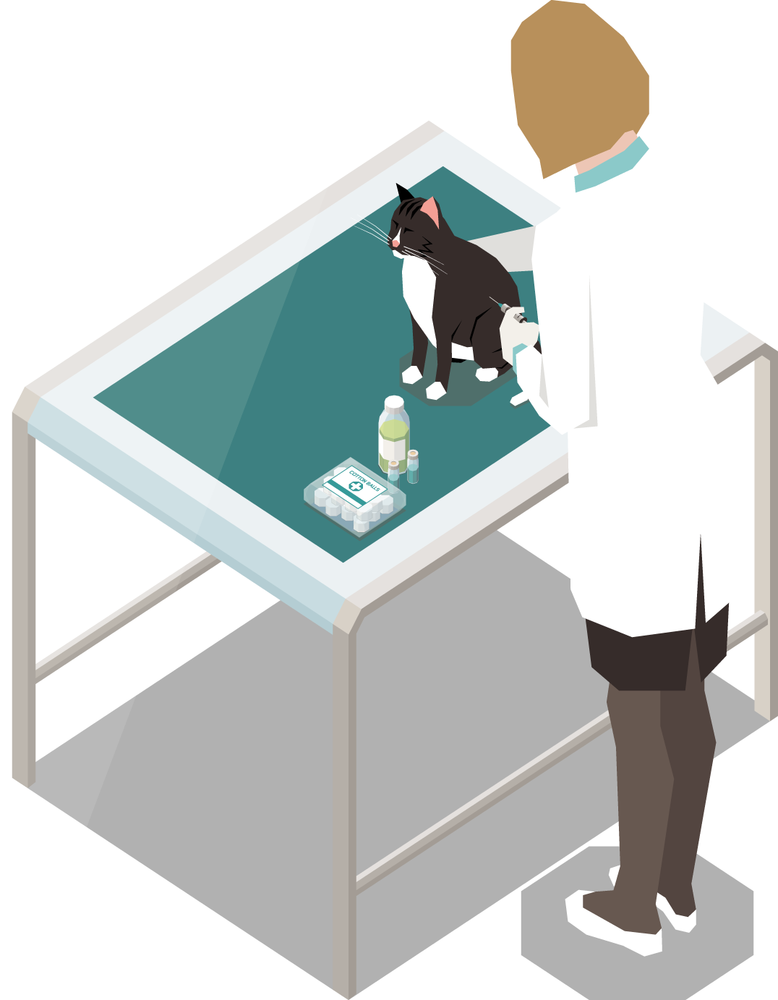
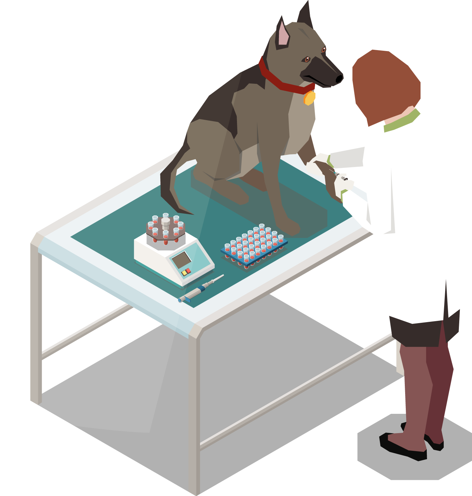
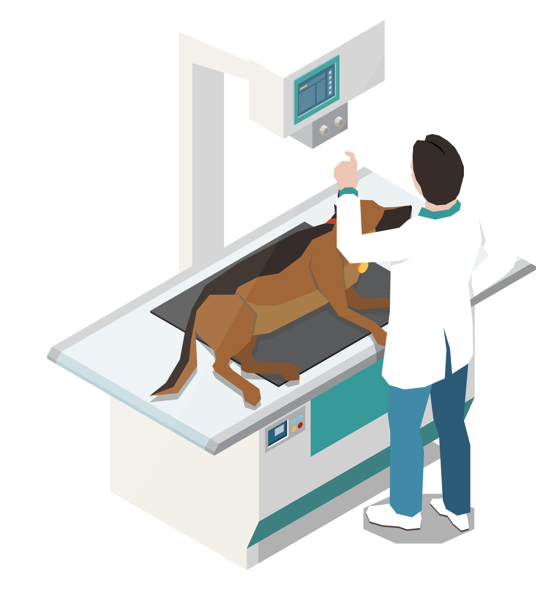

<!-- conectar  -->

<!DOCTYPE html>
<html lang="en">
<head>
   <meta charset="UTF-8">
   <meta http-equiv="X-UA-Compatible" content="IE=edge">
   <meta name="viewport" content="width=device-width, initial-scale=1.0">
   <title>Happy Pets</title>

   <link rel="icon" href="../../img/icon.png">

   <!-- font awesome cdn link  -->
   <link rel="stylesheet" href="https://cdnjs.cloudflare.com/ajax/libs/font-awesome/6.0.0/css/all.min.css">

   <!-- bootstrap cdn link  -->
   <link rel="stylesheet" href="https://cdnjs.cloudflare.com/ajax/libs/bootstrap/4.6.1/css/bootstrap.min.css">

   <!-- custom css file link  -->
   <link rel="stylesheet" href="./css/index.css">
   
   

</head>
<body>
   
<!-- header section starts  -->

<header class="header fixed-top">
         

               

                  <i class="fas fa-paw"></i>
                  <a href="#home" class="logo">happyPets.</a>
               

            
               <nav class="nav">
                  <a href="#home" class="menu-nav">Inicio</a>
                  <a href="#services" class="menu-nav">Servicio</a>
                  <a href="#about" class="menu-nav">Nosotros</a>
                  <a href="#contact" class="menu-nav">Contacto</a>
                  

                     <button class="btnLog">
                        <a href="./logReg/login.html" class="sesion">Iniciar Sesión</a>
                     </button>
                   

                  
</nav>
               

         

</header>

<!-- header section ends -->

<!-- home section starts  -->

<section class="home" id="home">

   

      

         

            <h3>La Salud de su Mascota es su Prioridad</h3>
            
Nos enorgullece brindarle a usted y a su 
             mascota una atención personalizada.

            <a href="./logReg/registerPets.php" class="link-btn">Registrate</a>
         

      

   

</section>

<!-- home section ends -->

<!-- services section starts  -->

<section class="services" id="services">

   <h1 class="heading">Servicios</h1>

   

      

         
         <h3>Peluquería</h3>
         
Lorem ipsum dolor sit amet consectetur adipisicing elit. Fugiat, non?

      

      

         
         <h3>Vacunación</h3>
         
Lorem ipsum dolor sit amet consectetur adipisicing elit. Fugiat, non?

      

      

         
         <h3>Higiene dental</h3>
         
Lorem ipsum dolor sit amet consectetur adipisicing elit. Esse, minima?

      

      

         
         <h3>Heridas</h3>
         
Lorem ipsum dolor sit amet consectetur adipisicing elit. Esse, minima?

      

      

         
         <h3>Análisis</h3>
         
Lorem ipsum dolor sit amet consectetur adipisicing elit. Esse, minima?

      

      

         
         <h3>Baño</h3>
         
Lorem ipsum dolor sit amet consectetur adipisicing elit. Esse, minima?

      

   

</section>

<!-- services section ends -->

<!-- about section starts  -->

<section class="about" id="about">

   

      

         

            
         

         

            sobre nosotros
            <h3>Lorem, ipsum dolor sit amet consectetur</h3>
            
Lorem, ipsum dolor sit amet consectetur adipisicing elit. Laboriosam cupiditate vero in provident ducimus. Totam quas labore mollitia cum nisi, sint, expedita rem error ipsa, nesciunt ab provident. Aperiam, officiis!

         

      

   

</section>

<!-- about section ends -->

<!-- process section starts  -->

<section class="process">

   <h1 class="heading">Proceso de Trabajo</h1>

   

      

         

            

               
               <h3>Vacuna</h3>
            

         

         

            

            
Vacunamos a su mascota con todo tipo de medicina, ya sea para la rabia, para la mordida, para garrapatas, etc

            

         

      

      

         

            

            
            <h3>Análisis</h3>
            

         

         

            

               
Lorem ipsum dolor sit amet consectetur, adipisicing elit. Vitae deserunt error esse ducimus itaque, laudantium perspiciatis 

            

         

         
      

      

         

            

               
               <h3>Radiografía</h3>
            

         

         

            

               
Contamos con la radiografía sin dañar a su mascota, cuando se siente mal o cuando se accidenta.

            

         

      

   

</section>

<!-- process section ends -->

<!-- contact section starts  -->

<section class="contact" id="contact">

   <h1 class="heading">Contacto</h1>

   <form autocomplete="off" action="./php/mensajesContact.php" method="POST" >
      Tu nombre :
      <input type="text" name="nombre" placeholder="ingrese su nombre" class="box" required>
      Tu correo :
      <input type="email" name="email" placeholder="ingrese su correo" class="box" required>
      Tu número :
      <input type="text" name="telefono" placeholder="ingrese su número" class="box" >
      Mensaje :
      <textarea name="mensaje" id="" cols="30" rows="4" class="box" placeholder="escribe su mensaje" required></textarea>
      <input type="submit" value="envíar" name="submit" class="link-btn" >
   </form>  

</section>

<!-- contact section ends -->

<!-- footer section starts  -->

<fotter class="footer">

   

      

         

            <i class="fas fa-paw"></i>
            <a href="#" class="logo">happyPets.</a>
         

      

      

         <h2>SOBRE NOSOTROS</h2>
         
Lorem ipsum dolor sit amet consectetur adipisicing elit. Molestias, incidunt!

         
Lorem ipsum dolor, sit amet consectetur adipisicing elit.

      

      

            <h2>Siguenos</h2>
         

            <a href="#"><i class="fab fa-facebook"></i></a>
            <a href="#"><i class="fab fa-instagram"></i></a>
            <a href="#"><i class="fab fa-whatsapp"></i></a>
         

      

   

   

      

      <small>&copy; 2022 <b>HappyPets.</b> - Todos los derechos reservados.</small>
   

</footer>

<!-- footer section ends -->

<!-- custom js file link  -->

</body>
</html>
